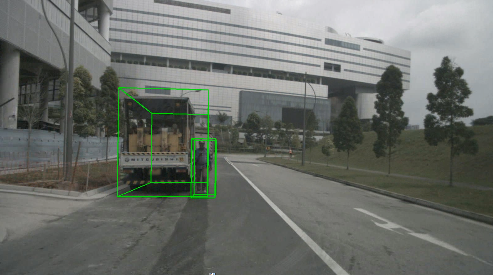

# TensorRT StreamPETR

## Prerequisites
- OS: Ubuntu (only tested on 22.04)
- ROS 2 (only tested on ROS 2 Humble)
- TensorRT (only tested on 8.6.1)

## Setup

Clone this repository.
```bash
git clone https://github.com/kminoda/StreamPETR_TensorRT_ROS2.git
```

### Step 1: Prepare ONNX

> [!TIP]
> You may bypass this step by directly downloading ONNX file from [google drive](https://drive.google.com/drive/folders/1GgsCzlHh0W6_kbCiGf-sIUCcuR1ediyh?usp=sharing).

Follow [ONNX conversion instruction from official repository and NVIDIA](https://github.com/NVIDIA/DL4AGX/blob/9a4f60c2847d32e81372b9a2165299a3b65eabf1/AV-Solutions/streampetr-trt/conversion/README.md).

For StreamPETR repository, please use this one: [./conversion/pth2onnx.py](./conversion/pth2onnx.py)

You may also use a [Dockerfile](https://github.com/kminoda/StreamPETR/blob/main/Dockerfile) created for this project.

Please store all the onnx files under `./data` directory.

```bash
data
├── simplify_extract_img_feat.onnx
├── simplify_position_embedding.onnx
└── simplify_pts_head_memory.onnx
```

### Step 2: TensorRT compilation

Compile with the following command (which originally comes from [the DL4AGX repository](https://github.com/NVIDIA/DL4AGX/tree/147cb1986549a1c0cc27769f24821ae6523ff5ef/AV-Solutions/streampetr-trt/inference_app#build-tensorrt-engine))

```bash
trtexec --onnx=./data/simplify_extract_img_feat.onnx --skipInference --saveEngine=./data/simplify_extract_img_feat.engine --fp16
trtexec --onnx=./data/simplify_pts_head_memory.onnx --skipInference --saveEngine=./data/simplify_pts_head_memory.engine
trtexec --onnx=./data/simplify_position_embedding.onnx --skipInference --saveEngine=./data/simplify_position_embedding.engine
```

Now the `./data` directory should look like this.
```bash
data
├── simplify_extract_img_feat.engine
├── simplify_extract_img_feat.onnx
├── simplify_position_embedding.engine
├── simplify_position_embedding.onnx
├── simplify_pts_head_memory.engine
└── simplify_pts_head_memory.onnx
```

### Step 3: Build this repository

```bash
rosdep install --from-paths . -iry --rosdistro $ROS_DISTRO
colcon build --symlink-install --cmake-args -DCMAKE_BUILD_TYPE=Release
```

## How to run

```bash
ros2 launch tensorrt_stream_petr tensorrt_stream_petr.launch.xml
```

## Useful scripts

### Play Nuscenes in ROS 2
You can use this script when launching the TensorRT StreamPETR node.
```bash
python3 scripts/nuscenes_to_ros.py --nuscenes_data_root <PATH_TO_YOUR_NUSCENES_DATASET>
```


### Visualization scripts
We have also provided some scripts for visualization for debugging purpose. Execute this alongside with the TensorRT StreamPETR node.

For 3D visualization on front camera:
```bash
python3 scripts/debug_visualize_3d.py
```



For BEV visualization:
```bash
python3 scripts/debug_visualize_bev.py
```

## Performance evaluation

Measured on NVIDIA GeForce RTX 4090.

| Model                           | Throughput (qps) | Latency (mean, ms) | Latency (p95, ms) | GPU Compute Time (mean, ms) |
|---------------------------------|------------------|--------------------|-------------------|-----------------------------|
| **simplify_extract_img_feat**   | 655.42           | 2.23946            | 2.495             | 1.52321                     |
| **simplify_pts_head_memory**    | 458.876          | 2.76451            | 2.7854            | 2.17572                     |
| **simplify_position_embedding** | 4805.41          | 0.368139           | 0.37793           | 0.186432                    |
